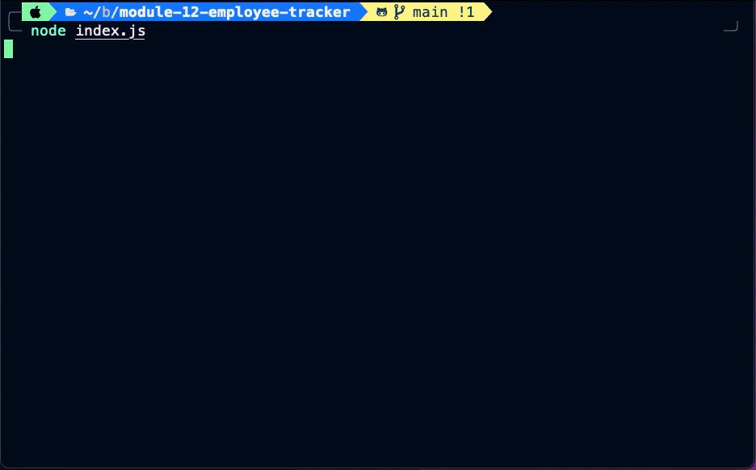

# Employee Tracker App

## Table of Contents

1. [Description](#description)
2. [Usage](#usage)

3. [Installation](#installation)
4. [Contributing](#contributing)

5. [Tests](#tests)

6. [License](#license)

7. [Questions](#questions)

## Description

Employee Tracker allows you to keep track of Departments, Employees and Roles

## Usage

Keep track of Departments, Employees and Roles data for company using a command-line application

Demo video can be viewed at: https://drive.google.com/file/d/1k5IH30LCKfP6LXQOu4AfsSkCxx_7Mf8n/view?usp=sharing

## Installation

Clone the repository

Install the required modules by running 'npm install'

Run the schema that is included with 'database.sql' file

Start application using 'node index.js'

## Contributing

Not Applicable

## Tests

Use application in command-line with 'node index.js'

Run through the various options in the menu for testing

## License

This project is licensed under the [MIT](https://opensource.org/licenses/MIT) license.

## Questions

Find me on GitHub: [EliteHuskie](https://github.com/EliteHuskie)

Contact me at: [EliteHuskie@gmail.com](mailto:EliteHuskie@gmail.com)